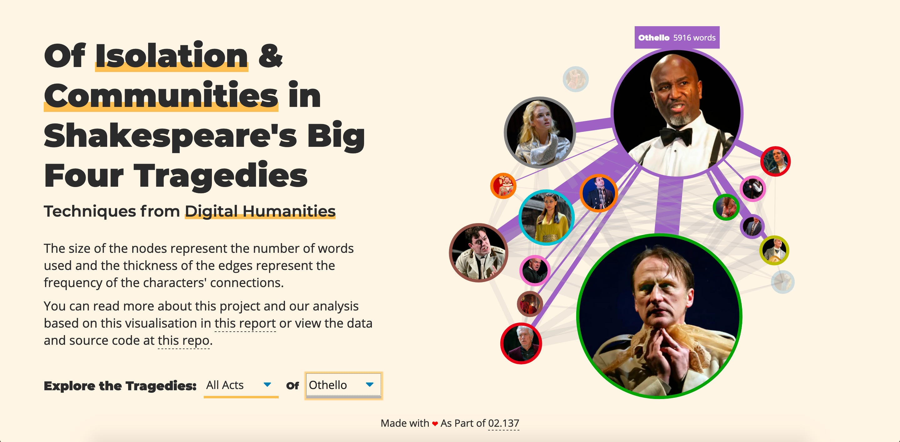
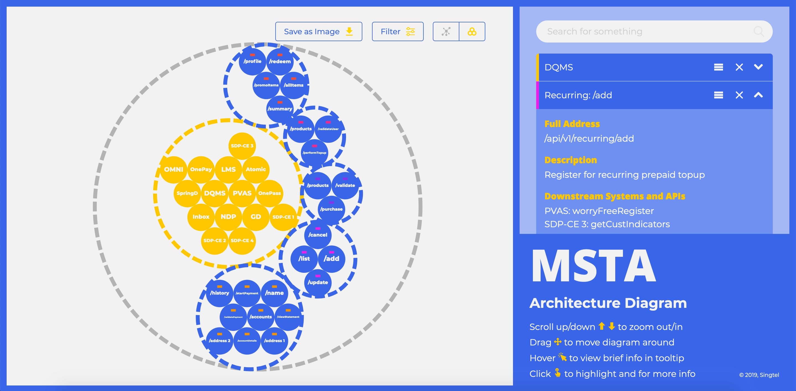

import DefaultPara from "../../../components/primitives/DefaultPara.js";
import ParaHead from "../../../components/primitives/ParaHead.js";

  <ParaHead number="01">Responsive and modern ticketing system</ParaHead>
  <DefaultPara>
    Recently, I found Steve on Twitter and saw how he was sharing design tips
    targeted at developers with no design background, I followed him in the
    blink of an eye. I'm not exaggerating when I say that he was one of my best
    follows in 2018. This is really incredible and thus I would like to share it
    with all of you.
  </DefaultPara>

